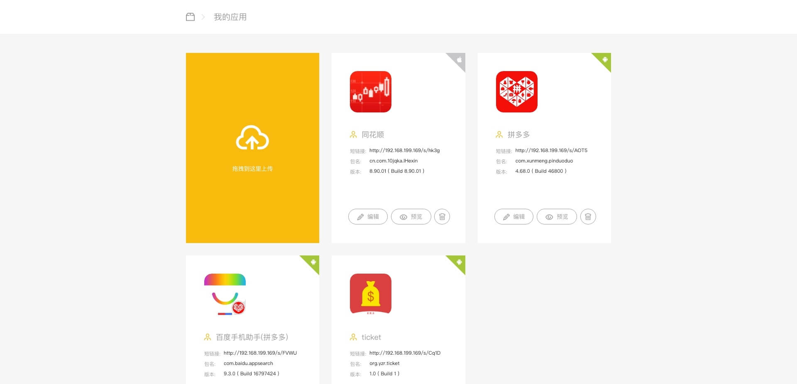
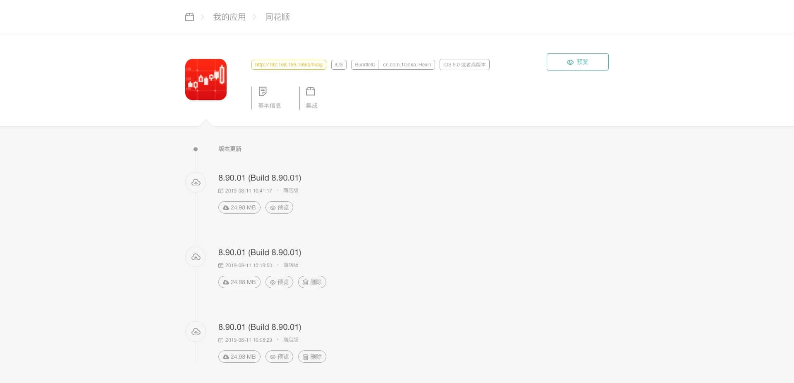
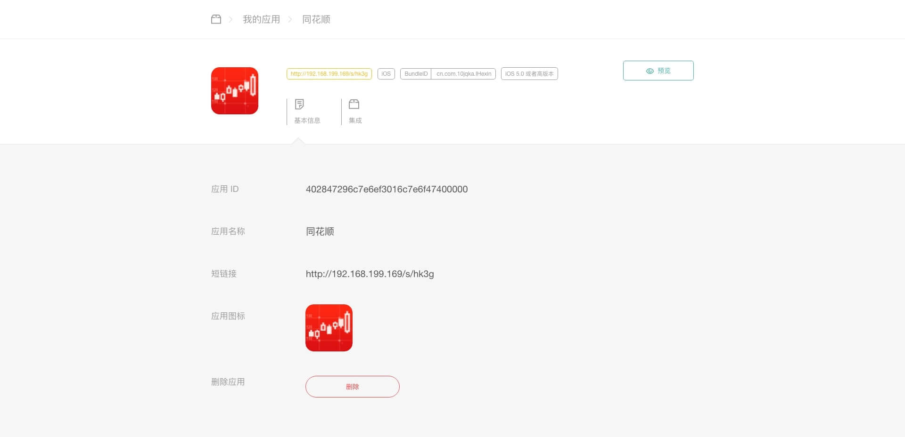
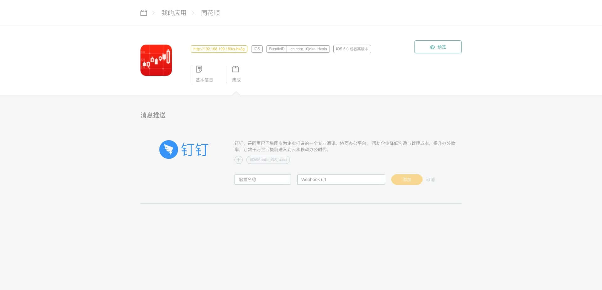
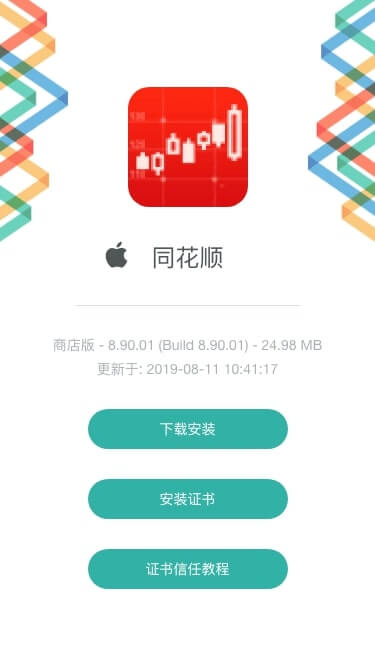
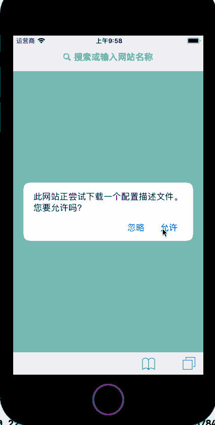
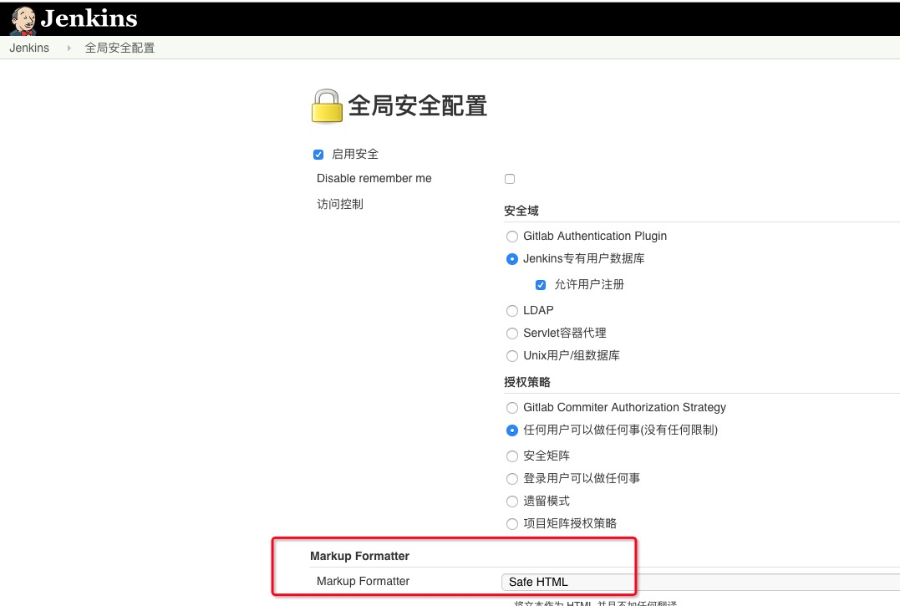
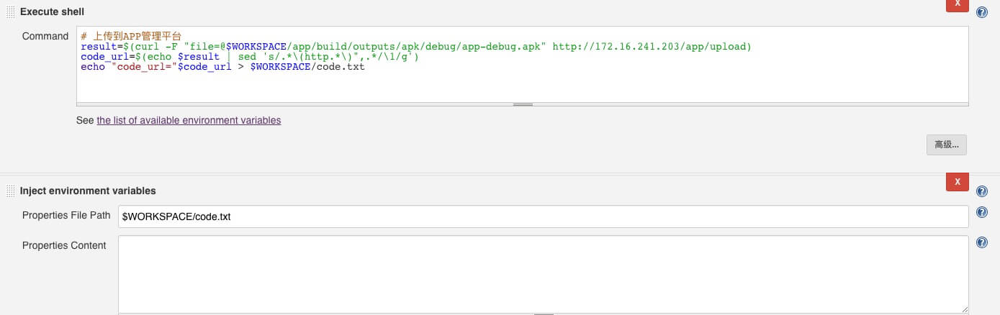

# 安装指南

#### 介绍
本项目使用 Spring Boot 开发的类似蒲公英和fir的企业内网 APP 分发平台，解决下载限制，实名认证等繁琐过程。

#### 效果

样式与 fir 一致，直接扒的。

##### 首页



##### 更新列表



##### 基本信息



##### 钉钉集成



##### 钉钉机器人消息


##### PC安装页


##### 手机安装页



##### 证书信任设置



#### 安装教程

项目使用 JAVA 开发，需要 JDK 1.8 运行环境，数据库使用的是 Mysql，需要安装 Mysql。JDK 安装直接找网上教程。

##### 数据库

>  Mac 下安装 MySQL

```shell
brew install mysql
# 后台运行 mysql
mysqld &
# 登录 mysql
mysql -u root -p
```

> 建库

```shell
# 创建库
create database app_manager DEFAULT CHARSET utf8 COLLATE utf8_general_ci;
```

##### HTTPS 证书

参考 [Spring Boot Https 证书](Spring_Boot_Https_证书.md) 创建证书，本项目使用的是 `pckcs12`，密码使用的是 `123456`，部署项目时证书需要自己创建。

##### 配置

 [下载](bin/bin.zip)，解压包。

> 配置 HTTPS

将上一步生成的 ca.crt 放入 `/static/crt/` 目录中，替换掉里面的 ca.crt，将上一步生成的 `server.pckcs12` 文件替换掉包中的原有文件。

如果生成的证书密码不是 `123456`，需要修改`/config/application.properties` 中的 `server.ssl.key-store-password`字段的值为自已设定的密码

> 修改域名

使用文本编辑器打开 `/config/application.properties`，将 `server.domain`字段修改为部署服务器的 IP 或域名。

#### 部署

本项目使用的是 80 和 443 端口，确保端口未被占用。可以配置文件中更改为别的端口。

> 启动服务

```shell
java -jar intranet_app_manager-1.0.0.jar
```

服务启动后即可输入你的 IP 或域名来访问。

> 上传与安装

可以将 ipa 或 apk 拖入上传块中进行上传，上传完成后会在列表中展示。

**注意**

本项目默认采用 http 方式访问，这样可以避免没必要的证书信任。iOS 安装需要使用 https 协议，由于内网部署是用的自建证书，需要将 ca 添加到设备的信用列表中才可正常进行安装。**设置抓包代理会影响自建证书**，导致无法下载。

#### Jenkins 集成 

集成会用上 Jenkins 展示 HTML，需要在 Jenkins 配置中打开 HTML 展示



> 上传脚本

```shell
# 上传到APP管理平台
result=$(curl -F "file=@$WORKSPACE/build/Ewt360_debug/Ewt360.ipa" http://172.16.241.203/app/upload)
code_url=$(echo $result | sed 's/.*\(http.*\)",.*/\1/g')
echo "code_url="$code_url > $WORKSPACE/code.txt
```

> 注入变量

Properties File Path:`$WORKSPACE/code.txt`

> 展示二维码

Description: `<a href="${code_url}" target="_blank"></a>`




